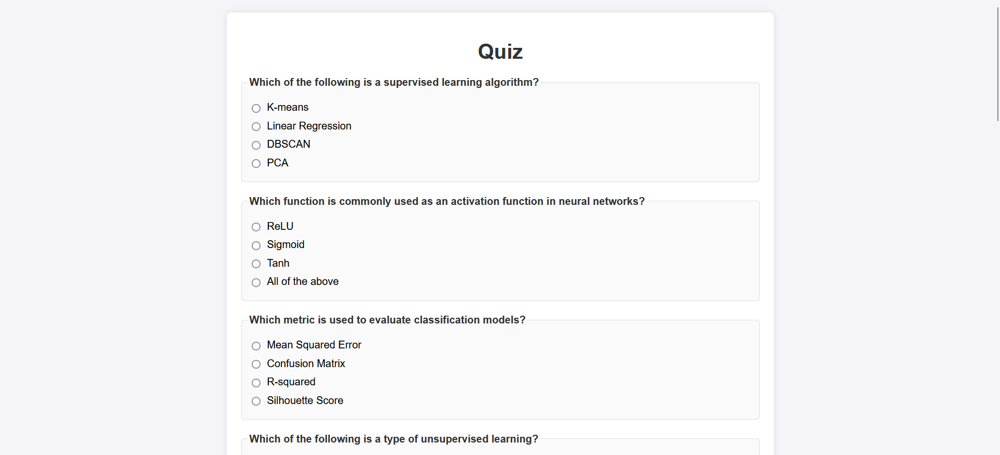
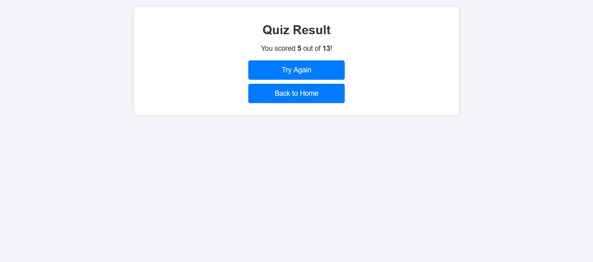

# QuizApp

**QuizApp** is a dynamic, interactive web-based quiz application built using Django. This app allows users to answer multiple-choice questions and view their scores in real-time. It also provides an admin panel to add, update, and manage quiz questions.

## **Features**

- **Dynamic Quiz**: Users can attempt a series of questions one by one.

- **Score Tracking**: Real-time score updates based on correct answers.

## **Installation**

1.  **Clone the Repository**

    ```
    git clone https://github.com/hardy07/quizapp.git
    cd quizapp
    ```

2.  **Create a Virtual Environment**

    ```
    python -m venv venv
    source venv/bin/activate  # For Linux/MacOS
    venv\Scripts\activate  # For Windows
    ```

3.  **Install Required Packages**

    ```
    pip install -r requirements.txt
    ```

4.  **Run Migrations**

    ```
    python manage.py makemigrations
    python manage.py migrate
    ```

5.  **Run the Development Server**

    ```
    python manage.py runserver
    ```

    Access the app at <http://127.0.0.1:8000/>.

# Screenshots

## 1. Home Page

The starting point of the quiz application where users can begin their quiz journey.  


---

## 2. Quiz Page

The main quiz interface where users answer presented questions.  


---

## 3. Results Page

The final page displaying the user’s score and quiz results.  

